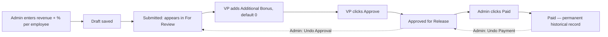

# MIP — Business Analysis
Manager's Incentive Platform, for Callbox (callboxmanagers.com). Self-hosted, private.

---

## Executive Summary

MIP replaces a spreadsheet-based commission workflow with a centralized, role-based, auditable web
application. It manages one continuous business process — compute → review → approve → release →
pay → report — for every employee, every payroll period.

Each employee has their own individual revenue figure and a manually-entered commission
percentage each period — there is no shared company-wide revenue number and no fixed tier table.

Four roles, all with private logins by username (never email, never public access): Developer,
Administrator (the Payroll Manager), VP (two accounts, equal authority — this is the role
previously labeled "Executive" in early planning; same role, Callbox's actual title for it), and
Employee (OM), who log in to see only their own commission history.

## Business Analysis

Spreadsheets create calculation drift, no enforced review gate before money moves, weak historical
auditability, and manual reporting overhead. MIP's value is the workflow enforcement and audit
trail around the math, not the arithmetic itself — the arithmetic is one multiplication.

### Core entities
`User` (login-capable: Administrator, VP, Developer, Employee), `Employee` (the commission record —
every Employee/OM has one; Administrator/VP/Developer never do), `Department`, `Branch`,
`PayrollPeriod`, `PayrollEntry`, `Payment`, `AuditLog`.

### The core workflow

Two distinct reversal actions, both Administrator-only, neither deletes anything: **Undo Payment**
(Paid → Approved for Release, the payment record stays and is flagged reversed) and **Undo
Approval** (Approved for Release → For Review, so the VP can correct the bonus and re-approve).

## Functional Requirements

### Authentication
- No public access, ever. Unauthenticated visitors see only logo, welcome text, and a login
  action.
- Login is by **username**, never email, never Google/social sign-in.
- Username: lowercase letters and numbers only, 6–12 characters, unique across every account —
  not just among Employees.
- Password: minimum 8 characters, at least one uppercase letter, at least one number, no special
  characters permitted.
- Every account's initial password is **system-generated** — shown once, on screen, at the moment
  Admin/Developer creates the account (there's no email service to send it, so whoever creates the
  account copies it and shares it directly). No forced change on first login; the person can keep
  it or change it anytime from their own Profile. Any password field shows a plain requirements
  label underneath it.
- Role is resolved server-side on every request. The Developer role is inert unless
  `ENABLE_DEVELOPER_ROLE` is explicitly set — off in production by default.

### Account Management (its own tab, not inside anyone's personal Profile)
- **No self-service sign-up, ever.** Every account — VP or Employee — is created manually by
  Administrator or Developer.
- An account can exist before that person has a single commission entry — account creation and
  first payroll entry are fully independent.
- Creating an Employee account creates both their commission record and their login together, in
  one action.
- The tab has two sections in its content area: **VP** and **OM** — kept visually separate since
  they're managed the same way but represent different kinds of people.
- **Developer can change Administrator's password. Administrator cannot change Developer's** — a
  deliberate exception, so Developer can recover Admin's access if she's ever locked out, without
  the reverse being true.
- **Administrator cannot see Developer's account or activity at all** — Developer accounts don't
  appear in Administrator's Account Management list or audit log views, at all, not just
  restricted detail. **Developer sees everyone's, including Administrator's.**
- **Developer has full, literal access to every action in the system** — including VP-only actions
  like Approve — specifically so Developer can test every flow end-to-end without hitting
  permission walls. This is understood to mean an audit log entry can show "Developer" as the
  actor on an action normally reserved for VP, during testing — acceptable since Developer is
  fully disabled in production.

### Employee Management
- Employees are **never hidden**. There is no archive/hide concept — every employee's record and
  full payroll history remain visible in every list, table, and report, permanently, whether or
  not they still work at the company.
- **Revoking access** is a single, separate action (three-dot menu on the employee's profile, or a
  button in Account Management) that disables their linked login only — it does not touch their
  record, their history, or their visibility anywhere.
- Only Employees (OM) ever appear in employee-facing lists and tables. Administrator, VP, and
  Developer never do — enforced structurally, since these views all query the employee records
  table, which only ever contains OM by construction.
- System-generated employee codes (format: `EMP-00001`) — no external HR system to match against.

### Commission Computation
- Formula, confirmed: **each employee's own Revenue × their own Commission % = Base Incentive
  (USD)**. Both figures are entered per employee, per period.
- Commission % is entered as a plain percentage number — 5 means 5%, 0.05 means 0.05% — never as a
  pre-computed decimal fraction. The ÷100 conversion happens once, inside the incentive
  calculation itself, nowhere else.
- No fixed tier table — percentage is a free field, chosen manually each time.

### Review, Approval, Payment
- Review: only Additional Bonus is editable (default 0.00, blank never allowed); every edit logs
  who, when, old value, new value.
- **Approve is VP-only.** Administrator does not get an Approve action on commissions, even though
  Administrator otherwise has full access — an intentional, explicit exception.
- Both VPs have equal authority over every employee — no per-employee assignment.
- Mark as Paid, Undo Payment, and Undo Approval are all Administrator-only.

### Reports & Historical Data
- Monthly, Employee, and Year-to-Date reports — read-only, never modify payroll.
- **Historical data (2025 to present) comes from a one-time spreadsheet fill-in**, not an in-app
  import feature — the completed spreadsheet gets loaded into the database directly as part of
  Sprint work. There is no permanent Bulk Import screen in the application.
- **Confirmed once the real spreadsheet was received: it is totals-only** — no revenue,
  commission percentage, or bonus breakdown available for historical periods, and department/
  branch are conflated in some source labels (e.g. "ILO CS APAC" = Iloilo + CS APAC). Historical
  data therefore imports as final-total-only, under real employee names with real login accounts
  created for them. Full per-field computation (separate revenue, percentage, bonus) begins fresh
  with the next new payroll month processed inside the app — history and going-forward data are
  allowed to have different levels of detail. Still open: the exact department/branch split for
  combined-label rows, and confirming "Admin & Support" as a real department missing from the
  originally seeded list.
- Exports carry company name, payroll period, generated date, generated by, and app version.

### Employee (OM) Self-Service
- OM sees only their own payroll history and current status — never another employee's data, never
  a company-wide dashboard.
- OM is strictly read-only on their own record — cannot review, approve, or edit anything.
- **Future, not this version**: a calculator tab where OM can independently re-compute their own
  commission to double-check it. Noted for later, not built now.

### Audit Logs
Every listed action (login/logout, employee changes, payroll lifecycle actions, payment/approval
undo, account creation, credential changes, role changes) produces an immutable row: timestamp,
user, IP (production only), action, affected record, result — subject to the Administrator/
Developer visibility asymmetry above.

## Non-Functional Requirements

| Category | Requirement |
|---|---|
| Performance | Dashboard renders in under 2 seconds; search is instant; all list views paginate |
| Security | RBAC enforced server-side on every mutating action, never trusting UI state alone |
| Security | Session idle timeout: 30 minutes |
| Security | No transactional email service anywhere in this application |
| Infra | Self-hosted, private, production domain callboxmanagers.com |
| Time | All timestamps and payroll-month boundaries use Asia/Manila time, regardless of branch |
| Currency | USD is the ledger currency everywhere, including the Colombia branch — no third currency in the system. A payroll period's PHP conversion always uses that period's own stored exchange rate, captured once at creation, never a "live" rate |
| Scale | 10–15 employees at launch, designed for up to 30. Confirmed accounts at launch: Developer, Administrator, 2× VP, plus Employee accounts created as needed |
| Accessibility | Keyboard navigation, ARIA labels, proper contrast, semantic HTML, responsive layout |

## User Roles & Permission Matrix

| Capability | Administrator | VP | Developer | Employee (OM) |
|---|---|---|---|---|
| View company-wide dashboard / reports | ✓ | ✓ | ✓ | ✗ |
| View own commission history only | — | — | — | ✓ |
| Create / edit employee records | ✓ | ✗ | ✗ | ✗ |
| Enter revenue & commission % | ✓ | ✗ | ✗ | ✗ |
| Edit Additional Bonus | ✗ | ✓ | ✗ | ✗ |
| Approve payroll | ✗ | ✓ | ✓ (testing only) | ✗ |
| Undo Approval / Mark Paid / Undo Payment | ✓ | ✗ | ✓ (testing only) | ✗ |
| Create VP or Employee accounts | ✓ | ✗ | ✓ | ✗ |
| Revoke an employee's access | ✓ | ✗ | ✓ | ✗ |
| Change own username/password | ✓ | ✓ | ✓ | ✓ |
| Change Administrator's password | ✗ | ✗ | ✓ | ✗ |
| Change a VP's or Employee's password | ✓ | ✗ | ✓ | ✗ |
| See Developer's account/activity | ✗ | ✗ | ✓ (own) | ✗ |
| See Administrator's account/activity | — | ✗ | ✓ | ✗ |
| View audit logs | ✓ (all but Developer) | ✓ (read) | ✓ (all, including Admin) | ✗ |

## Risks

| Risk | Notes |
|---|---|
| Rounding/precision in commission math | Mitigated by fixed-point `NUMERIC` types throughout, and a single ÷100 conversion point for percentages |
| Ex-employee retaining system access | Mitigated by the one-click revoke-access action being separate from, and not dependent on, any archive/hide step |
| Developer's literal full-access during testing shows in the audit trail | Accepted — Developer is non-production only |
| Scope size vs. solo-developer pace | See Development Roadmap — the honest current estimate is ~45 days of focused, most-days effort, not calendar weeks of idle time |
