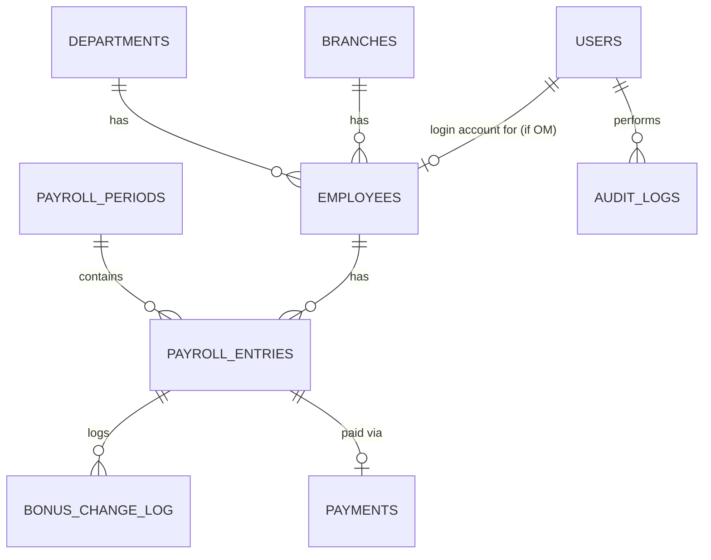

# MIP — Database Design

This is a design specification for Tony(Builder) to translate into Drizzle schema files — it is
architecture documentation, not application source.

---

## Entity Overview



## Key Design Decisions

**`users` vs. `employees` are different things, linked, not merged.** `users` is anyone who can log
in — Administrator, VP, Developer, Employee(OM) — authenticated by username. `employees` is the
commission-earning business entity — what every employee-facing list, table, and report queries.
An `employees` row optionally links to a `users` row (`user_id`, nullable) once that person has an
account. **Enforced invariant: an `employees` row exists if and only if that person is OM.**
Administrator, VP, and Developer never get one.

**No archive, ever.** Every employee stays visible, everywhere, permanently — there is no hidden/
filtered state for employee records at all. The only thing that can change is whether their linked
login is active. Revoking access sets `users.is_active = false`; it never touches the `employees`
row, never removes them from any list or report.

**Commission percentage is stored as the percentage number itself, not a fraction.** `0.05` in this
column means `0.05%`; `5` means `5%`. The only division by 100 happens inside the incentive
calculation in the Service Layer — nowhere else. This was a deliberate choice to avoid the
data-entry and round-trip-conversion errors that come with typing or displaying values like
`0.0005`.

**Money and rates are always `NUMERIC`, never `float`/`double`.**

## Schema (PostgreSQL DDL)

```sql
-- ── Lookup tables ─────────────────────────────────────────────

CREATE TABLE departments (
  id SERIAL PRIMARY KEY,
  name VARCHAR(100) NOT NULL UNIQUE,
  is_active BOOLEAN NOT NULL DEFAULT TRUE,
  created_at TIMESTAMPTZ NOT NULL DEFAULT now()
);

CREATE TABLE branches (
  id SERIAL PRIMARY KEY,
  name VARCHAR(100) NOT NULL UNIQUE,
  is_active BOOLEAN NOT NULL DEFAULT TRUE,
  created_at TIMESTAMPTZ NOT NULL DEFAULT now()
);

-- ── Users: everyone who can log in ──

CREATE TYPE user_role AS ENUM ('administrator', 'vp', 'developer', 'employee');

CREATE TABLE users (
  id UUID PRIMARY KEY DEFAULT gen_random_uuid(),
  username VARCHAR(12) NOT NULL UNIQUE,        -- lowercase letters + digits, 6-12 chars
  display_name VARCHAR(150) NOT NULL,
  password_hash TEXT NOT NULL,                 -- managed by Better Auth
  role user_role NOT NULL,
  is_active BOOLEAN NOT NULL DEFAULT TRUE,      -- false = access revoked
  last_login_at TIMESTAMPTZ,
  created_by UUID REFERENCES users(id),         -- which Admin/Developer created this account
  created_at TIMESTAMPTZ NOT NULL DEFAULT now(),
  updated_at TIMESTAMPTZ NOT NULL DEFAULT now(),
  CHECK (char_length(username) >= 6 AND char_length(username) <= 12),
  CHECK (username = lower(username))
);

-- ── Employees (OM). Never hidden. Optional link to a login account. ──

CREATE TABLE employees (
  id UUID PRIMARY KEY DEFAULT gen_random_uuid(),
  employee_code VARCHAR(20) NOT NULL UNIQUE,    -- system-generated, e.g. EMP-00001
  full_name VARCHAR(150) NOT NULL,
  department_id INTEGER NOT NULL REFERENCES departments(id),
  branch_id INTEGER NOT NULL REFERENCES branches(id),
  employment_status VARCHAR(20) NOT NULL DEFAULT 'active',  -- active | former — a label only,
                                                              -- never used to hide/filter this row
  user_id UUID UNIQUE REFERENCES users(id),     -- null until an account is created for them
  created_by UUID REFERENCES users(id),
  updated_by UUID REFERENCES users(id),
  created_at TIMESTAMPTZ NOT NULL DEFAULT now(),
  updated_at TIMESTAMPTZ NOT NULL DEFAULT now()
);
CREATE INDEX idx_employees_department ON employees(department_id);
CREATE INDEX idx_employees_branch ON employees(branch_id);
CREATE INDEX idx_employees_search ON employees USING gin (to_tsvector('english', full_name));

-- ── Payroll periods — period-level metadata + exchange rate ──

CREATE TYPE payroll_status AS ENUM (
  'draft', 'computing', 'under_review', 'approved', 'released', 'paid', 'closed', 'archived'
);

CREATE TABLE payroll_periods (
  id UUID PRIMARY KEY DEFAULT gen_random_uuid(),
  period_month SMALLINT NOT NULL CHECK (period_month BETWEEN 1 AND 12),
  period_year SMALLINT NOT NULL,
  status payroll_status NOT NULL DEFAULT 'draft',
  exchange_rate_usd_php NUMERIC(10,4) NOT NULL CHECK (exchange_rate_usd_php > 0),
  -- Captured once, at period creation, and never changed afterward. Every PHP display for
  -- this period always uses this stored rate, never a "live" rate, even while still open.
  opened_at TIMESTAMPTZ,
  closed_at TIMESTAMPTZ,
  created_by UUID REFERENCES users(id),
  updated_by UUID REFERENCES users(id),
  created_at TIMESTAMPTZ NOT NULL DEFAULT now(),
  updated_at TIMESTAMPTZ NOT NULL DEFAULT now(),
  UNIQUE (period_month, period_year)
);

-- ── Payroll entries — revenue and commission % both entered per employee ──

CREATE TYPE entry_status AS ENUM (
  'not_started', 'computed', 'under_review', 'approved', 'paid', 'archived'
);

CREATE TABLE payroll_entries (
  id UUID PRIMARY KEY DEFAULT gen_random_uuid(),
  payroll_period_id UUID NOT NULL REFERENCES payroll_periods(id),
  employee_id UUID NOT NULL REFERENCES employees(id),
  revenue_usd NUMERIC(16,2) NOT NULL CHECK (revenue_usd >= 0),
  commission_percentage NUMERIC(7,4) NOT NULL CHECK (commission_percentage >= 0),
    -- The percentage NUMBER, e.g. 0.0500 means 0.05%, 5.0000 means 5%. Never a decimal fraction.
  base_incentive_usd NUMERIC(14,2) NOT NULL,   -- revenue_usd * (commission_percentage / 100)
  additional_bonus_usd NUMERIC(14,2) NOT NULL DEFAULT 0.00 CHECK (additional_bonus_usd >= 0),
  total_incentive_usd NUMERIC(14,2)
    GENERATED ALWAYS AS (base_incentive_usd + additional_bonus_usd) STORED,
  status entry_status NOT NULL DEFAULT 'not_started',
  version INTEGER NOT NULL DEFAULT 1,           -- optimistic concurrency — two VPs share full access
  reviewed_by UUID REFERENCES users(id),
  reviewed_at TIMESTAMPTZ,
  approved_by UUID REFERENCES users(id),        -- cleared on Undo Approval
  approved_at TIMESTAMPTZ,                      -- cleared on Undo Approval
  created_by UUID REFERENCES users(id),
  created_at TIMESTAMPTZ NOT NULL DEFAULT now(),
  updated_at TIMESTAMPTZ NOT NULL DEFAULT now(),
  UNIQUE (payroll_period_id, employee_id)
);
CREATE INDEX idx_entries_period ON payroll_entries(payroll_period_id);
CREATE INDEX idx_entries_employee ON payroll_entries(employee_id);
CREATE INDEX idx_entries_status ON payroll_entries(status);

-- PHP amount is derived at read/export time (total_incentive_usd * the period's stored
-- exchange_rate_usd_php) — not stored redundantly.

-- ── Structured before/after log for bonus edits ──

CREATE TABLE bonus_change_log (
  id UUID PRIMARY KEY DEFAULT gen_random_uuid(),
  payroll_entry_id UUID NOT NULL REFERENCES payroll_entries(id),
  changed_by UUID NOT NULL REFERENCES users(id),
  old_value NUMERIC(14,2) NOT NULL,
  new_value NUMERIC(14,2) NOT NULL,
  reason TEXT,
  changed_at TIMESTAMPTZ NOT NULL DEFAULT now()
);

-- ── Payments — append-only. Undo flips is_undone, never deletes. ──

CREATE TABLE payments (
  id UUID PRIMARY KEY DEFAULT gen_random_uuid(),
  payroll_entry_id UUID NOT NULL UNIQUE REFERENCES payroll_entries(id),
  paid_amount_usd NUMERIC(14,2) NOT NULL,
  paid_amount_php NUMERIC(14,2) NOT NULL,
  payment_date DATE NOT NULL,
  paid_by UUID NOT NULL REFERENCES users(id),
  is_undone BOOLEAN NOT NULL DEFAULT FALSE,
  undone_by UUID REFERENCES users(id),
  undone_at TIMESTAMPTZ,
  undo_reason TEXT,
  created_at TIMESTAMPTZ NOT NULL DEFAULT now()
);

-- ── Generic, immutable audit trail. Visibility rules (Administrator can't see Developer's
--    activity; Developer sees everyone's) are enforced when querying this table, in the
--    Service Layer — not by hiding rows from anyone at the database level. ──

CREATE TABLE audit_logs (
  id BIGSERIAL PRIMARY KEY,
  user_id UUID REFERENCES users(id),
  action VARCHAR(100) NOT NULL,   -- e.g. 'employee.create', 'payroll_entry.approve',
                                   -- 'payroll_entry.undo_approval', 'account.create'
  entity_type VARCHAR(50) NOT NULL,
  entity_id VARCHAR(100) NOT NULL,
  ip_address INET,                -- production only
  metadata JSONB,
  created_at TIMESTAMPTZ NOT NULL DEFAULT now()
);
CREATE INDEX idx_audit_entity ON audit_logs(entity_type, entity_id);
CREATE INDEX idx_audit_user ON audit_logs(user_id);
CREATE INDEX idx_audit_created ON audit_logs(created_at);
```

## Seed Data

```sql
INSERT INTO departments (name) VALUES
  ('CS NAM'), ('CS APAC'), ('Finance'), ('IT'), ('Software Development'),
  ('Sales NAM'), ('Sales APAC');

INSERT INTO branches (name) VALUES
  ('Iloilo'), ('Davao'), ('Colombia');
```

## Historical Data (2025–present)

**Confirmed once the real spreadsheet arrived: it's totals-only** — no per-employee revenue,
commission percentage, or bonus breakdown, just a final incentive total per person per period.
This is loaded once, directly, from the completed spreadsheet template — not through any in-app
import screen — as a one-time seed script that inserts the matching `payroll_periods`,
`payroll_entries`, and `payments` rows directly, in `paid` status. No `employees.user_id` gets set
as part of this — login accounts remain a separate, deliberate action by Administrator or
Developer, always.

**Open item, not yet resolved**: `payroll_entries.revenue_usd` and `.commission_percentage` are
`NOT NULL` in the schema above, but totals-only historical data has neither figure. Before writing
the seed script, decide explicitly — don't guess — how historical rows populate these columns
(e.g. a documented placeholder value, or a schema change like a nullable pair plus a
`is_historical` flag). This is a real gap between this schema and the confirmed data shape, worth
a deliberate five-minute decision rather than whatever the seed script happens to do first.

## Account Creation Flow

1. Administrator or Developer opens the Accounts tab (VP section or OM section).
2. For OM: fills in name, department, branch (creates the `employees` row if new) plus a username
   — the system generates the initial password. For VP: fills in name and username only.
3. Both the `employees` row (if OM) and the `users` row are created together, linked via
   `employees.user_id`. This can happen with zero `payroll_entries` for that person.
4. The generated password is shown once, on screen, for Admin/Developer to copy and share directly
   — never emailed, never shown again after that moment.
